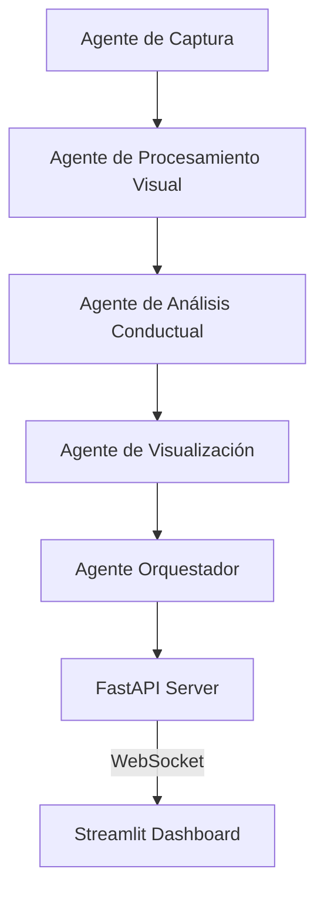

# PROYECTO_ENTREVISTA
Este proyecto es de prueba para un  análisis de gestos  
# 🎭 Orquesta de Agentes IA para Entrevistas en Vivo

Este proyecto implementa una solución avanzada basada en una orquesta de agentes de Inteligencia Artificial para la detección de gestos, expresiones y comportamientos en tiempo real durante entrevistas.

## 🧠 Arquitectura del Sistema

El sistema utiliza una arquitectura modular basada en agentes especializados:



- **Agente de Captura**: Obtiene el video en tiempo real desde la cámara o archivo.
- **Agente de Procesamiento Visual**: Extrae landmarks faciales, de manos y postura usando MediaPipe.
- **Agente de Análisis Conductual**: Interpreta los landmarks para detectar emociones y métricas de comportamiento (estrés, confianza).
- **Agente de Visualización**: Formatea los datos y prepara la transmisión de video para el dashboard.
- **Agente Orquestador**: Coordina el flujo de datos entre todos los agentes.

## ⚙️ Tecnologías Usadas

- **Lenguaje**: Python 3.10+
- **Visión**: OpenCV, MediaPipe
- **Backend**: FastAPI, WebSockets
- **Frontend**: Streamlit
- **Modelado de Datos**: Pydantic

## 🚀 Instalación y Ejecución

### 1. Requisitos previos
Asegúrate de tener instalado Python y `pip`.

### 2. Instalación de dependencias
```bash
pip install -r requirements.txt
```

### 3. Ejecutar el Servidor API
```bash
uvicorn api.server:app --host 0.0.0.0 --port 8000
```

### 4. Ejecutar el Dashboard
```bash
streamlit run dashboard/app.py
```

## 📊 Funcionalidades del Dashboard

- **Visualización en Vivo**: Stream de video procesado.
- **Indicadores de Emociones**: Desglose en tiempo real de estados emocionales.
- **Métricas de Comportamiento**: Barras de progreso para Estrés, Confianza y Nerviosismo.
- **Análisis de Postura**: Identificación de la postura corporal.

## 🐳 Docker

Para ejecutar usando Docker:

```bash
docker build -t ai-orchestra .
docker run -p 8000:8000 -p 8501:8501 ai-orchestra
```

## 🧪 Pruebas
Ejecuta las pruebas unitarias con:
```bash
python3 -m pytest tests/
```
